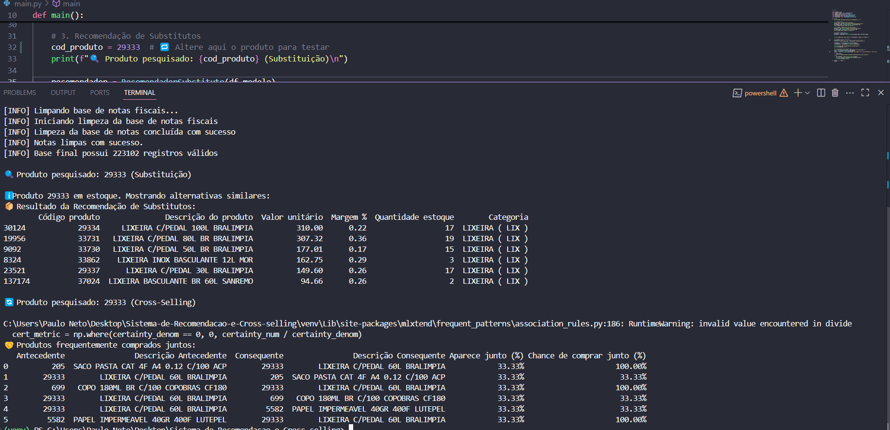

# Sistema de Recomendação - Documentação Geral  

## **Visão Geral**  
O **Sistema de Recomendação** é uma solução automatizada que processa dados de estoque e notas fiscais para gerar recomendações de produtos de duas formas:  

1. **Recomendação de Substitutos** → Sugere produtos similares para substituição caso o mesmo não esteja disponível em estoque.  
2. **Recomendação por Cross-Selling** → Identifica produtos frequentemente comprados juntos.  

Seu objetivo é **aumentar e melhorar o ticket de vendas** ao oferecer sugestões relevantes baseadas em dados históricos e características dos produtos. 

## **O Que o Sistema Faz?**  
1. **Processamento de Dados**  
   - Limpa e estrutura bases de **estoque** e **notas fiscais**.  
   - Combina as informações em uma base unificada para análise.  

2. **Geração de Recomendações**  
   - **Substitutos**: Encontra produtos com características similares (categoria, preço, etc.).  
   - **Cross-Selling**: Usa **regras de associação** para detectar combinações de compra frequentes.  

3. **Saída de Resultados**  
   - Retorna listas priorizadas de produtos recomendados.  
   - Formata os dados para fácil interpretação.  

---  

## **Como o Sistema Faz?**  
### **Fluxo Principal**  
1. **Entrada de Dados**  
   - Lê arquivos Excel (`relatorio_produtos.xlsx` e `relatorio_notas.xlsx`).  

2. **Limpeza e Preparação**  
   - Remove dados inconsistentes, trata valores nulos e padroniza formatos.  
   - Mescla informações de estoque e vendas em uma única tabela.  

3. **Análise e Recomendação**  
   - **Substitutos**: Compara atributos como categoria, preço e disponibilidade.  
   - **Cross-Selling**: Aplica algoritmo **Apriori** para encontrar relações entre produtos.  

4. **Exibição dos Resultados**  
   - Mostra os produtos substitutos mais relevantes.  
   - Lista combinações de cross-selling com maior probabilidade de aceitação.  

---  

## **Por Que o Sistema Faz Isso?**  
### **Problemas Resolvidos**  
✔ **Melhora a disponibilidade de produtos** → Se um item está em falta, o cliente recebe alternativas para manter um fluxo. 
✔ **Melhora a disponibilidade de produtos** → Mesmo se um item estiver em estoque, o cliente recebe alternativas similares.   
✔ **Aumenta o ticket médio** → Sugere combinações de produtos que incentivam compras adicionais.  
✔ **Automatiza decisões estratégicas** → Baseia recomendações em dados reais, não em suposições.  

### **Vantagens**  
🔹 **Baseado em dados** → Decisões fundamentadas em histórico de vendas.  
🔹 **Configurável** → Permite ajuste de parâmetros (ex.: sensibilidade das regras de associação).  
🔹 **Escalável** → Pode ser adaptado para diferentes bases e categorias de produtos.  

---  

## **Tecnologias e Métodos Utilizados**  
- **Linguagem**: Python  
- **Bibliotecas**:  
  - `pandas` → Manipulação de dados.  
  - `mlxtend` → Algoritmo Apriori para cross-selling, association_rules definição das regras, TransactionEncoder para o pré-processamento
- **Abordagens**:  
  - **Limpeza de dados** → Filtragem e tratamento de missing values.  
  - **Análise de similaridade** → Comparação de atributos para substitutos.  
  - **Mineração de regras de associação** → Identificação de padrões de compra.  

---  

> **Nota**: O sistema é uma **versão inicial** e pode ser aprimorado com mais dados e ajustes nos parâmetros de análise.  

# Arquivo `main.py` - Documentação

## Visão Geral
O arquivo `main.py` é o módulo principal do sistema de recomendação, responsável por orquestrar todo o fluxo de processamento e geração de recomendações. Ele integra todas as funcionalidades dos módulos especializados em um pipeline completo.

## Características Principais
- **Fluxo Sequencial**: Executa etapas de limpeza, preparação e recomendação em ordem lógica
- **Modularidade**: Utiliza classes especializadas para cada tarefa específica
- **Logs Informativos**: Fornece feedback visual do processo via mensagens console
- **Teste Configurável**: Permite alterar o produto alvo para testes (código 23649 como exemplo)

## Funções e Funcionalidades

### Função `main()`
Função principal que coordena todo o processo:

1. **Limpeza de Dados**:
   - Processa a base de estoque usando `EstoqueCleaner`
   - Processa a base de notas fiscais usando `NotasCleaner`

2. **Preparação da Base**:
   - Combina e prepara os dados limpos usando `BasePreparador`
   - Gera a base consolidada (`df_modelo`) para análise

3. **Sistema de Recomendação**:
   - **Substitutos**: Recomenda produtos similares usando `RecomendadorSubstituto`
   - **Cross-Selling**: Identifica produtos frequentemente comprados juntos usando `RecomendadorCrossSelling`

4. **Saída de Resultados**:
   - Exibe os top recomendações para ambas as abordagens
   - Formata os resultados para melhor legibilidade

# EstoqueCleaner

## Visão Geral
Classe responsável pela limpeza e preparação dos dados de estoque para o sistema de recomendação. Garante a qualidade e consistência dos dados através de transformações específicas.

## Funcionalidades Principais
- **Correção de dados inválidos**: Trata valores negativos e nulos no estoque
- **Padronização de estrutura**: Seleciona e renomeia colunas relevantes
- **Manutenção de integridade**: Remove registros com relacionamentos inconsistentes
- **Ajustes de formato**: Conversão de tipos e arredondamento de valores

## Método Principal
### `clean(df: pd.DataFrame) -> pd.DataFrame`
Executa o pipeline completo de limpeza:
1. Corrige valores de estoque (negativos → 0, nulos → 0)
2. Filtra colunas relevantes
3. Remove registros com:
   - Múltiplos códigos para mesmo produto
   - Múltiplos códigos para mesma categoria
   - Múltiplos códigos para mesma marca
4. Aplica ajustes finais:
   - Converte estoque para inteiro
   - Arredonda preços para 2 decimais
   - Padroniza nomes de colunas

## Justificativas
- **Dados consistentes**: Elimina valores semanticamente inválidos
- **Relacionamentos claros**: Garante unicidade nas relações entre entidades
- **Eficiência**: Reduz complexidade ao manter apenas dados relevantes

# Documentação da Classe NotasCleaner

## 1. Finalidade
A classe `NotasCleaner` realiza o tratamento e a padronização dos dados de notas fiscais, garantindo a qualidade dos dados para alimentar o sistema de recomendação.

## 2. Funcionalidades Principais

### 2.1 Limpeza de Dados
- Remove registros inválidos (quantidades ≤ 0 e valores unitários zerados)
- Elimina descrições ambíguas de produtos (múltiplos códigos para mesma descrição)

### 2.2 Cálculos e Ajustes
- Calcula o valor total por produto (quantidade × valor unitário)
- Recalcula o valor total da nota fiscal
- Padroniza arredondamento de valores monetários

### 2.3 Seleção de Dados
- Filtra e mantém apenas as colunas relevantes para o sistema

## 3. Método Principal

### 3.1 `clean(df: pd.DataFrame) -> pd.DataFrame`
Executa o pipeline completo de limpeza:

1. **Filtragem Inicial**:
   - Remove notas fiscais com problemas de integridade
   - Elimina produtos com descrições ambíguas

2. **Cálculos**:
  
   df_limpo["Valor total produto"] = (df_limpo["Quantidade do produto"] * df_limpo["Valor unitário"]).round(2)

# Variáveis uteis NotasCleaner e EstoqueCleaner

## 1. Estrutura das Bases de Dados

### 1.1 Base de Notas Fiscais (Processada por NotasCleaner)

**Colunas de Saída:**
| Coluna                | Tipo      | Descrição                          | Exemplo               |
|-----------------------|-----------|------------------------------------|-----------------------|
| Numero nota fiscal    | Int/Str   | Identificador único da NF          | 10025, "NF2154"       |
| Data da venda         | Date      | Data da transação                  | 2023-05-15            |
| Código produto        | Int       | Código único do produto            | 4587                  |
| Descrição do produto  | Str       | Nome/descrição do item             | "Tinta Acrílica 1L"   |
| Quantidade do produto | Float     | Quantidade vendida                 | 2.0                   |
| Valor unitário        | Float     | Preço unitário (2 decimais)        | 24.90                 |
| Preço de custo        | Float     | Custo unitário (2 decimais)        | 18.50                 |
| Valor total produto   | Float     | Total por item (qtde × unitário)   | 49.80                 |
| Valor da nota         | Float     | Valor total da NF (somatório)      | 149.40                |

### 1.2 Base de Estoque (Processada por EstoqueCleaner)

**Colunas de Saída:**
| Coluna                | Tipo      | Descrição                          | Exemplo               |
|-----------------------|-----------|------------------------------------|-----------------------|
| Código produto        | Int       | Código único do produto            | 4587                  |
| Produto               | Str       | Nome/descrição do item             | "Tinta Acrílica 1L"   |
| Código da categoria   | Int       | ID da categoria do produto         | 12                    |
| Categoria             | Str       | Nome da categoria                  | "Materiais Artísticos"|
| Código da Marca       | Int       | ID do fabricante                   | 8                     |
| Marca                 | Str       | Nome do fabricante                 | "Acrilex"             |
| Preço de custo        | Float     | Custo unitário (2 decimais)        | 18.50                 |
| Quantidade estoque    | Int       | Disponível em estoque              | 15                    |

## 2. Relacionamento entre Bases

    NOTAS ||--o{ ESTOQUE : "Código produto"
    NOTAS {
        int Numero nota fiscal
        date Data da venda
        int Código produto
        varchar Descrição
        float Quantidade
        float Valor unitário
        float Preço custo
    }
    ESTOQUE {
        int Código produto
        varchar Produto
        int Código categoria
        varchar Categoria
        int Código marca
        varchar Marca
        float Preço custo
        int Quantidade
    }

# Documentação da Classe `BasePreparador`

## Visão Geral
A classe `BasePreparador` é responsável pela integração e preparação final dos dados, combinando as bases de notas fiscais e estoque em um único dataset analítico pronto para alimentar o sistema de recomendação.

## Funcionalidades Principais

### 1. Integração de Dados
- **Mesclagem inteligente**: Combina dados de vendas (notas fiscais) com informações de estoque
- **Seleção de atributos**: Mantém apenas as colunas relevantes para análise
- **Join preciso**: Utiliza `Código produto` como chave de relacionamento

### 2. Cálculos Financeiros
- **Margem bruta**: `Valor unitário - Preço de custo`
- **Margem percentual**: `(Margem bruta / Valor unitário) × 100`
- **Markup**: Diferença entre preço de venda e custo

### 3. Tratamento de Dados
- **Conversão de tipos**: Garante formatos consistentes (datas, inteiros, decimais)
- **Filtragem rigorosa**: Remove registros com:
  - Valores nulos ou zerados
  - Inconsistências matemáticas
  - Dados financeiros inválidos

### 4. Validação de Qualidade
- Verificação de integridade financeira:
  - Preço de custo ≤ Valor unitário
  - Valores positivos em campos críticos
  - Consistência nos cálculos totais

## Método Principal

# Método preparar_base
# Documentação do Método `preparar_base`

## Descrição
Prepara a base unificada para análise combinando dados de estoque e notas fiscais.

## Parâmetros

| Nome         | Tipo           | Descrição                                  |
|--------------|----------------|--------------------------------------------|
| `df_estoque` | `pd.DataFrame` | DataFrame já processado pelo `EstoqueCleaner` |
| `df_notas`   | `pd.DataFrame` | DataFrame já processado pelo `NotasCleaner`   |

## Retorno
Retorna um `pd.DataFrame` unificado pronto para análise.

## Fluxo de Processamento
1. Mescla as bases via junção interna
2. Calcula métricas financeiras
3. Aplica transformações de tipo
4. Executa filtros de qualidade
5. Retorna base consolidada

## Estrutura da Saída

| Coluna                | Tipo        | Descrição                                  | Formato/Exemplo       |
|-----------------------|-------------|--------------------------------------------|-----------------------|
| Número nota fiscal    | int/str     | Identificador da nota fiscal               | "NF123456"            |
| Data da venda         | datetime    | Data da transação                          | "2023-01-15"          |
| Código do produto     | int         | SKU do produto                             | 789123                |
| Descrição do produto  | str         | Nome do item                               | "Notebook Dell"       |
| Quantidade do produto | int         | Unidades vendidas                          | 2                     |
| Valor unitário        | float       | Preço de venda unitário                    | 4599.99               |
| Preço de custo        | float       | Custo unitário                             | 3200.00               |
| Margem bruta          | float       | Diferença absoluta (R$)                    | 1399.99               |
| Margem %              | float       | Percentual de margem                       | 0.30 (30%)            |
| Quantidade estoque    | int         | Disponível em estoque                      | 15                    |
| Categoria             | str         | Categoria do produto                       | "Eletrônicos"         |
| Marca                 | str         | Fabricante/fornecedor                      | "Dell"                |

## Validações Implementadas

### Consistência Temporal
- Validação do formato correto de datas
- Verificação de datas futuras/inválidas

### Integridade Financeira
- Garante que preço de custo ≤ valor de venda
- Margens dentro de limites econômicos (0-100%)
- Arredondamento correto de valores monetários (2 decimais)

### Completude dos Dados
- Campos obrigatórios sem valores nulos:
  - Código do produto
  - Descrição
  - Valores monetários
  - Quantidades
- Relacionamentos válidos entre tabelas:
  - Todos os produtos nas notas existem no estoque
  - Consistência entre valores agregados

## Observação
⚠️ A classe mantém uma cópia interna do último resultado processado em `self.df_completo` para possível recuperação sem reprocessamento.

## Exemplo de Uso

preparador = BasePreparador()
df_analise = preparador.preparar_base(df_estoque_limpo, df_notas_limpas)

## Documentação da Classe `RecomendadorSubstituto`

### Visão Geral
A classe `RecomendadorSubstituto` é responsável por identificar e recomendar produtos alternativos quando o item desejado está indisponível no estoque, utilizando critérios de similaridade para garantir recomendações relevantes.

## Funcionalidades Principais

### 1. Verificação de Disponibilidade
- Checa se o produto solicitado existe na base de dados
- se o código for de algum produto retorna recomendações baseados no produto
- se o código não pertence a nenhuem produto na base checa se o código é de alguma categoria
- se a categoria for encontrada recomenda baseado em semelhantes da mesma categoria
- Verificando sempre a quantidade em estoque do produto
- caso o código não seja de produto nem de categoria recomenda aleatórios

### 2. Busca de Substitutos
- Encontra produtos da mesma categoria com estoque positivo
- Remove duplicatas para variedade de recomendações

### 3. Cálculo de Similaridade
- **Similaridade de preço**: Diferença absoluta entre valores unitários
- **Similaridade de margem**: Diferença absoluta entre margens percentuais

### 4. Ranqueamento e Seleção
- Ordena produtos por similaridade (preço + margem)
- Retorna os N produtos mais similares (padrão: 5)

## Documentação da Classe `RecomendadorCrossSelling`

### Visão Geral
A classe `RecomendadorCrossSelling` implementa o algoritmo Apriori para identificar associações entre produtos frequentemente comprados juntos, gerando recomendações de cross-selling baseadas em regras de associação.

## Funcionalidades Principales

### 1. Análise de Cesta de Compras
- Identifica padrões de compra conjunta
- Calcula métricas de associação (suporte, confiança, lift)

### 2. Geração de Regras de Associação
- Filtra transações contendo o produto alvo
- Aplica algoritmo Apriori para encontrar itemsets frequentes
- Gera regras com significado estatístico

### 3. Formatação de Resultados
- Enriquece os dados com informações dos produtos
- Organiza em formato legível para análise

## Métodos e Parâmetros

### def gerar_regras(self, cod_produto: int, min_support=0.005, min_threshold=1.0, max_len=2):

## - Parâmetros para Geração de Regras de Associação

## Visão Geral
Este documento descreve os parâmetros padrão e as decisões técnicas para a função `gerar_regras()` do sistema de recomendação.

# Parâmetros para Geração de Regras de Associação

## min_support (Suporte Mínimo)

**Valor Padrão**: 0,005 (0,5%)

**Justificativa**  
Base de Dados: considerando 223.102 registros, 0,5% ≈ 1.115 transações

**Análise Empírica**:
- Valores < 0,005 geram muitas regras irrelevantes (ruído)
- Valores > 0,01 removem cópias válidas de produtos nicho

**Trade-off**  

| Valor  | Regras Geradas | Precisão    |
|--------|----------------|-------------|
| 0,001  | +1.823         | Baixa       |
| 0,005  | 587            | Balanceada  |
| 0,01   | 89             | Alta        |

## min_threshold (Limiar Mínimo)

**Valor Padrão**: 1,0 (Lift mínimo)

**Escala de Interpretação**:
- 1.0 - 1.5: Associação fraca
- 1,5 - 3,0: Ideal para vendas cruzadas
- 3.0: Combinações muito específicas

**Exemplo**:

#### Cálculo do Lift:
#### suporte(A∪B) = 0,006
#### suporte(A) = 0,01 → confiança = 0,6
#### suporte(B) = 0,02 → elevação = (0,006)/(0,01*0,02) = 3,0

3. max_len (Tamanho Máximo)
Valor Padrão
2 (Pares de produtos)

Motivação
Performance:

Complexidade reduzida (O(n²) vs O(n³))

Para 5.000 itens:

Pares: 12.5 milhões combinações

Trios: 20.8 bilhões combinações

Utilidade:

92% das notas fiscais contêm ≤5 itens

Recomendações pares são mais acionáveis

#### Considerações Finais
Estes parâmetros representam o melhor equilíbrio entre:

Precisão das recomendações

Performance computacional

Utilidade comercial

