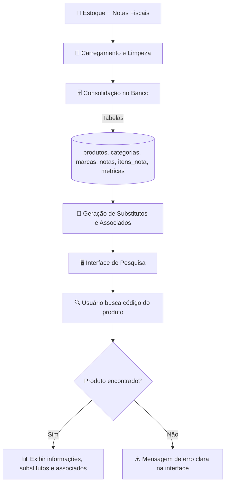
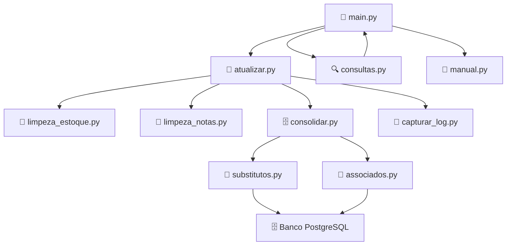
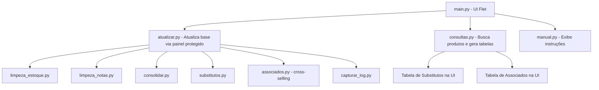

# Sistema de Recomendação de Produtos -- MVP v1.0

Sistema desenvolvido em Python para fornecer recomendações de produtos em vendas, com foco em **substitutos** (produtos similares) e **associados** (cross-selling). O sistema analisa dados de estoque e notas fiscais, gera regras de associação e apresenta uma interface gráfica interativa.

## 📌 Funcionalidades

1. **Recomendação de Substitutos**
   - Sugere produtos similares da mesma categoria quando um item não está disponível ou para sugerir alternativas de preço e margem.
   - Considera preço, margem e estoque para oferecer alternativas relevantes.

2. **Recomendação de Produtos Associados (Cross-Selling)**
   - Indica produtos frequentemente comprados juntos com base em regras de associação usando um modelo de Machine Learning (FP-Growth).
   - Com o objetivo de aumentar o ticket médio das vendas.

3. **Atualização Automática da Base**
   - Carrega e limpa automaticamente as bases de estoque e notas fiscais.
   - Gera tabelas consolidadas no banco de dados PostgreSQL.
   - Permite atualização assíncrona e acompanhamento via UI.

4. **Interface Interativa**
   - Pesquisa de produtos por código.
   - Exibinpdo as informações do produto pesquisado.
   - Exibição de resultados de substitutos e produtos associados em tabelas.
   - Painel com controles de atualização da base, com acesso mediante senha.
   - Logs de processamento e progresso visíveis durante a atualização.
   - Manual integrado para orientação do usuário.

5. **Armazenamento e Persistência**  
   - Base de dados **PostgreSQL** estruturada em tabelas normalizadas:  
     - `produtos` — Cadastro dos produtos disponíveis.  
     - `categorias` — Classificação dos produtos por categorias .  
     - `marcas` — Registro das marcas associadas aos produtos.  
     - `notas` — Informações das notas fiscais.  
     - `itens_nota` — Detalhamento dos itens presentes em cada nota fiscal.  
     - `metricas` — Regras de associação gerados pelos modelos de recomendação.  

## 🛠 Tecnologias e Dependências

- **Python 3.13.5+**
- **Bibliotecas**:
  - pandas==2.3.0  
  - numpy==2.3.2  
  - openpyxl==3.1.5  
  - mlxtend==0.23.1  
  - scipy==1.16.1  
  - SQLAlchemy==2.0.43  
  - psycopg2-binary==2.9.10  
  - flet==0.26.0  
  - python-dateutil==2.9.0  
  - pytz==2025.2    
  - **Banco de Dados**: PostgreSQL 15+

## ⚙️ Estrutura do Projeto
``` 
├── assets/ # Arquivos de mídia ou ícones da interface
├── bases/ # Arquivos Excel de estoque e notas fiscais
├── venv/ # Ambiente virtual Python
├── .gitignore # Arquivos e pastas ignorados pelo Git
├── associados.py # Geração e consulta de produtos associados (cross-selling)
├── atualizador_regras.py # Atualiza e mantém as regras de associação
├── atualizar.py # Fluxo de atualização das bases no sistema
├── capturar_log.py # Captura e registra logs de execução
├── consolidar.py # Consolida dados em tabela única de produtos
├── consultas.py # Classes de busca e consultas no banco de dados
├── data_utils.py # Funções utilitárias para tratamento e manipulação de dados
├── limpeza_estoque.py # Limpeza e padronização da base de estoque
├── limpeza_notas.py # Limpeza e padronização da base de notas fiscais
├── main.py # Interface principal (Flet)
├── manual.py # Componente UI com instruções do sistema
├── README.md # Documentação do projeto
├── requeriments.txt # Dependências do projeto
├── substitutos.py # Geração de produtos substitutos
└── ultima_atualizacao.txt# Log da última atualização da base
```

## ⚡ Como Usar

### 1. Configurar o Banco de Dados
- Instale e configure PostgreSQL.
- Crie o banco `rec`.
- Certifique-se que o usuário tenha permissões de leitura e escrita.

### 2. Instalar Dependências

pip install -r requirements.txt

### 3. Preparar Bases de Dados

- depois da senha fornecida no painel e os campos de upload estiver habilitado
- faça o upload dos arquivos, o sistema irá criar o caminho adequado `bases/`.
- Nome sugerido:
  - `relatorio_produtos.xlsx`
  - `relatorio_notas.xlsx`

### 4. Executar o Sistema


python main.py

### 📖 Modo de Uso

- Digite o **código do produto** no campo de pesquisa e pressione **Enter** ou clique em **Pesquisar**.  
- O sistema exibirá:  
  - Informações do produto pesquisado.  
  - Tabela de produtos **substitutos**.  
  - Tabela de produtos **associados**.  
- Para limpar os resultados e voltar ao modo de uso, clique em **Limpar pesquisa**.  

### 🔐 Painel de Controle
- Ao lado do campo de pesquisa há um **painel protegido por senha**.  
- Com a senha correta, são liberados:  
  - Campos para upload dos arquivos de **estoque** e **notas fiscais**.  
  - O botão **Atualizar bases de dados**.  
- Ao acionar a atualização:  
  - O sistema processa, trata e consolida os dados no banco de dados.  
  - Calcula e atualiza as métricas de recomendação.  
  - Exibe em tempo real as **etapas do processamento** diretamente no painel.  


#### 🔄 Fluxo do Sistema

- O sistema carrega e trata os dados de **estoque** e **notas fiscais**.  
- Consolida e atualiza as tabelas no banco (`produtos`, `categorias`, `marcas`, `notas`, `itens_nota`, `metricas`).  
- Gera recomendações de **substitutos** e **produtos associados**.  
- A interface exibe os resultados ao pesquisar um código de produto.  
## 🔄 Fluxo do Sistema (Visual)


```mermaid
flowchart TD
    A[📂 Estoque + Notas Fiscais] --> B[🧹 Carregamento e Limpeza]
    B --> C[🗄️ Consolidação no Banco]
    C -->|Tabelas| D[(produtos, categorias, marcas, notas, itens_nota, metricas)]
    D --> E[🤝 Geração de Substitutos e Associados]
    E --> F[🖥️ Interface de Pesquisa]
    F --> G[🔍 Usuário busca código do produto]
    G --> H{Produto encontrado?}
    H -- Sim --> I[📊 Exibir informações, substitutos e associados]
    H -- Não --> J[⚠️ Mensagem de erro clara na interface]
```
## 📝 Observações

- Na primeira execução, o sistema gera arquivos de **log** e popula o banco com a base consolidada.  
- Em caso de **código inválido** ou **produto não encontrado**, mensagens claras são exibidas na interface.  
- As recomendações são controladas para evitar inserções desnecessárias no banco.  

## 📝 Notas Técnicas
- As atualizações da base são controladas pelo **painel de atualização com senha**, garantindo segurança simples no processo.  
- O sistema utiliza **regras de associação (FP-Growth)** para identificar produtos frequentemente comprados juntos, com **suporte** e **confiança** ajustáveis.  
- **Logs detalhados** de execução e atualização são registrados automaticamente (`capturar_log.py`).  
- As métricas consolidadas ficam salvas diretamente no **banco de dados**.  
- A interface foi desenvolvida em **Flet**, oferecendo usabilidade simples e responsiva.  

## 💡 Dicas
- Sempre utilize o **código completo do produto** para obter resultados precisos.  
- Confira os **substitutos sugeridos** antes de recomendar alternativas ao cliente.  
- Explore os **produtos associados** para identificar oportunidades de **vendas cruzadas** e aumentar o ticket médio.  

## 🔒 Segurança e Observações

- Banco PostgreSQL deve estar protegido com senha e acessível apenas à rede confiável.
- Evite executar o sistema em redes públicas sem VPN ou firewall adequado.

## ⚙️ Fluxo de Execução e Dependências entre Arquivos

### 1. main.py
- Ponto de entrada do sistema (**interface Flet**).  
- Cria a interface de pesquisa de produtos, exibindo:  
  - Informações do produto pesquisado.  
  - Tabelas de **substitutos** e **associados**.  
- Conecta-se ao banco de dados **PostgreSQL** via **SQLAlchemy**.  
- Dependências chamadas:  
  - `consultas.py` → consultas ao banco (produtos, substitutos e associados).  
  - `manual.py` → componente de UI com instruções do sistema.  
  - `atualizar.py` → executa o fluxo de atualização da base pelo painel protegido por senha.  

---

### 2. atualizar.py
- Responsável por coordenar o processo de atualização da base.  
- Funções principais:  
  - Receber os arquivos enviados pelo painel de atualização.  
  - Chamar sequencialmente os módulos de limpeza e consolidação:  
    - `limpeza_estoque.py` → limpa e padroniza a base de estoque.  
    - `limpeza_notas.py` → limpa e padroniza a base de notas fiscais.  
    - `consolidar.py` → consolida dados em tabelas normalizadas (`produtos`, `categorias`, `marcas`, `notas`, `itens_nota`).  
  - Atualizar métricas no banco (`metricas`).  
- Integra com:  
  - `substitutos.py` → geração de produtos substitutos.  
  - `associados.py` → geração de produtos associados (cross-selling) via Apriori.  
  - `capturar_log.py` → registro detalhado das etapas de processamento.  

---

### 3. consultas.py
- Fornece funções e classes para **pesquisa de produtos** no banco.  
- Retorna dados organizados para exibição na interface (produto pesquisado, substitutos e associados).  

---

### 4. data_utils.py
- Utilitários auxiliares para manipulação e validação de dados.  
- Funções comuns usadas nos módulos de limpeza e processamento.  

---

### 5. demais módulos
- `manual.py` → exibe instruções do sistema na interface.  
- `substitutos.py` → lógica de recomendação de produtos substitutos.  
- `associados.py` → lógica de cross-selling usando regras de associação (FP-Growth).  
- `atualizador_regras.py` → atualização/manutenção das regras de associação.  
- `capturar_log.py` → gera e armazena logs detalhados.  

## 📊 Fluxo de Dependências entre Arquivos


```mermaid
flowchart TD
    A[📌 main.py] --> B[🔐 atualizar.py]
    B --> C[🧹 limpeza_estoque.py]
    B --> D[🧹 limpeza_notas.py]
    B --> E[🗄️ consolidar.py]
    E --> F[🤝 substitutos.py]
    E --> G[🤝 associados.py]
    F --> H[🗄️ Banco PostgreSQL]
    G --> H
    A --> I[🔍 consultas.py]
    I --> A
    A --> J[📖 manual.py]
    B --> K[📝 capturar_log.py]
```

**Legenda do fluxo:**  
- `main.py` → interface principal, ponto de entrada.  
- `atualizar.py` → gerencia o fluxo de atualização via painel protegido por senha.  
- `limpeza_estoque.py` e `limpeza_notas.py` → padronizam as bases.  
- `consolidar.py` → consolida as tabelas normalizadas no banco.  
- `substitutos.py` e `associados.py` → geram recomendações.  
- `consultas.py` → fornece dados organizados para exibição na interface.  
- `capturar_log.py` → registra logs detalhados de processamento.  


## 📊 Diagrama de Fluxo de Dados do Sistema


```mermaid
flowchart TD
    A[main.py - UI Flet] --> B[atualizar.py - Atualiza base via painel protegido]
    B --> C[limpeza_estoque.py]
    B --> D[limpeza_notas.py]
    B --> E[consolidar.py]
    B --> F[substitutos.py]
    B --> G[associados.py - cross-selling]
    B --> H[capturar_log.py]
    A --> I[consultas.py - Busca produtos e gera tabelas]
    A --> J[manual.py - Exibe instruções]
    I --> K[Tabela de Substitutos na UI]
    I --> L[Tabela de Associados na UI]
```

